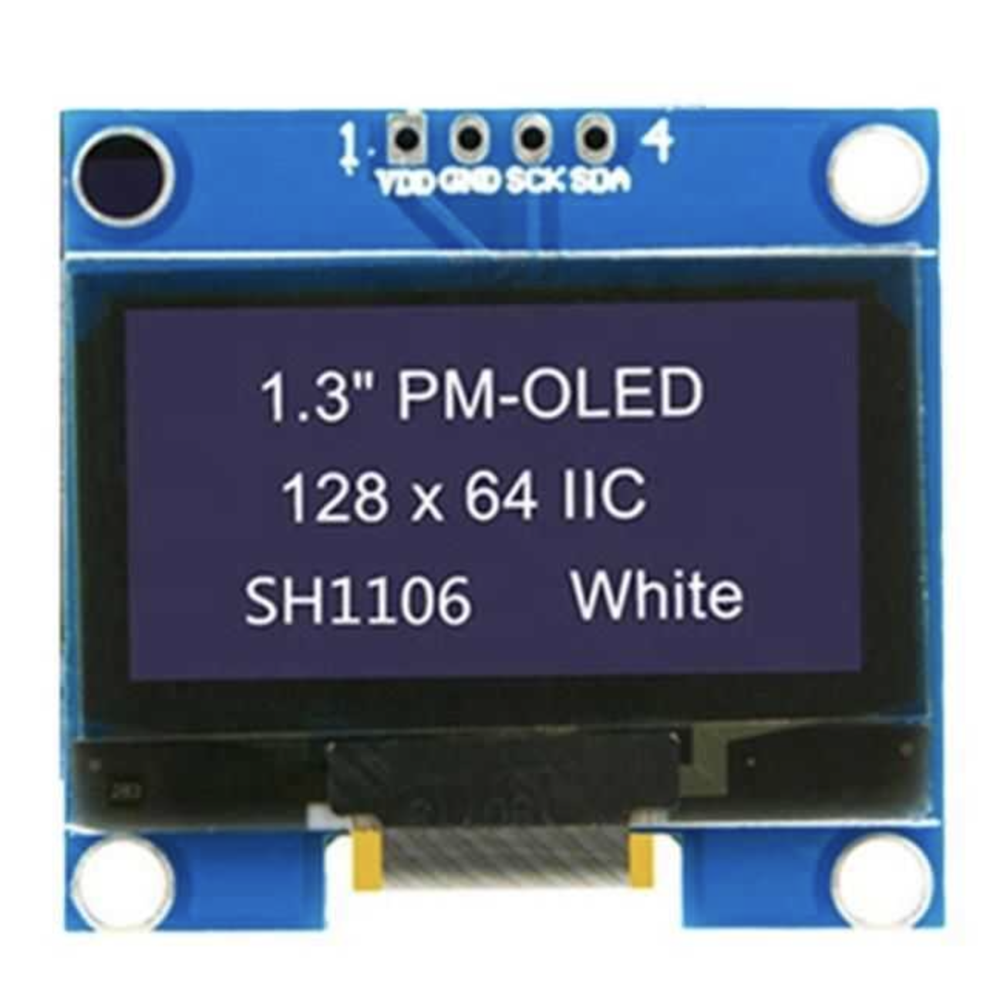
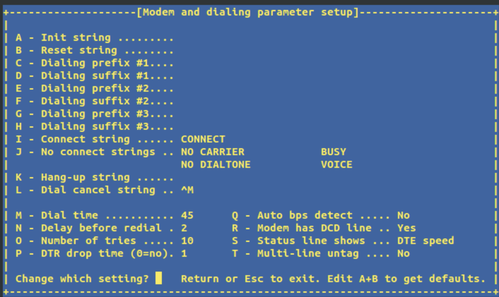
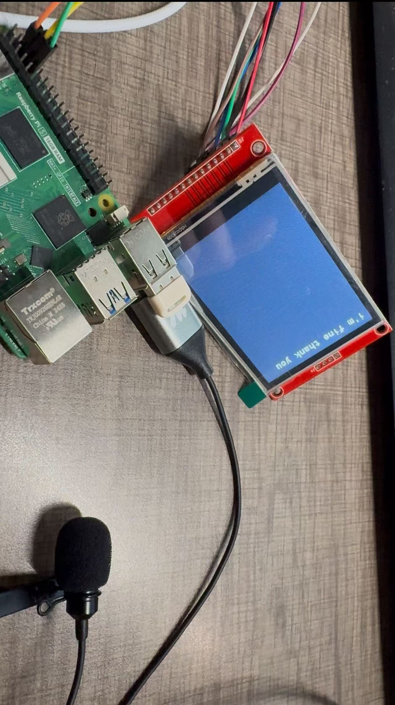

# Voice Recognition Embedded Prototype

A weekly log of our progress building a Raspberry Pi–STM32 based voice transcription demo, from initial model deployment to final PCB soldering and software optimization.

---

## Table of Contents

- [Overview](#overview)  
- [Hardware & Software Stack](#hardware--software-stack)  
- [Weekly Progress](#weekly-progress)  
- [Next Steps](#next-steps)  

---

## Overview

We’re building an always‑listening voice transcription system using:
- **Raspberry Pi 5** running the VOSK offline speech-recognition model  
- **STM32 (Nucleo)** microcontroller to handle UART and digital‑mic interfaces  
- **OLED display** (GME12864) for on‑device text output  
- **Power‑bank** solution for reliable 5 A supply  

---

## Hardware & Software Stack

- **Compute**: Raspberry Pi 5 (5 A supply requirement)  
- **Microcontroller**: STM32 Nucleo board (UART + DMA + PDM‐mic)  
- **Display**: GME12864 monochrome I²C OLED (SSD1306‐compatible)  
- **Microphone**: USB mic (final), PDM digital mic (planned)  
- **Speech SDK**: [VOSK](https://github.com/alphacep/vosk-api)  
- **UART test tool**: `minicom`  
- **Tutorials & References**:  
  - VOSK on Pi 5: https://www.youtube.com/watch?v=-0W_AxSD_t8  
  - OLED + Arduino: https://www.instructables.com/Monochrome-096-i2c-OLED-display-with-arduino-SSD13/  
  - Power‑bank DIY: https://www.bilibili.com/video/BV1Ft421j7j6  

---

## Weekly Progress

### Week 1: VOSK Deployment  
- Deployed and tested the VOSK model on Raspberry Pi 5.  
- Followed [this YouTube tutorial](https://www.youtube.com/watch?v=-0W_AxSD_t8) for guidance.

### Week 2: Breadboard OLED Demo  
- Used an Arduino + GME12864 OLED to display static text.  
- Goal: forward UART‐received strings from Pi → Arduino → OLED.  
- Based on this [Instructables guide](https://www.instructables.com/Monochrome-096-i2c-OLED-display-with-arduino-SSD13/).

### Week 3: Power & UART Challenges  
- **UART** between Pi 5 ↔ Arduino (RX/TX swap) failed—no data.  
- Discovered Pi 5 must be powered with a 5 A supply; our booster was insufficient.  
- Considered DC–DC and power‐management IC designs, but opted to integrate a ready‐made power bank for reliability.

### Week 4: Migrating to STM32 & Mic Plans  
- Switched from Arduino to STM32 Nucleo (USB port occupied Pi UART).  
- **UART test** with `minicom` passed: Pi → STM32 text transmission confirmed.  
- **Mic demo** failed: analog mic quality was too low for VOSK input.  
- Decided to output digital audio via PDM mic instead of UART + DMA audio stream.

### Week 5: USB Mic & Display Integration  
- Lost PDM mic in shipping—used USB mic on Pi as fallback; mic capture now works.  
- OLED display now shows live transcription, end‑to‑end.  
- Noted transcription speed is slow → software optimization needed.

### Week 6: PCB Arrival  
- Received custom PCB (with stencil).  
- Next: solder SMT parts and test hardware integration.

### Week 7: UART‐Driven Display Optimization  
- Refactored STM32 firmware: moved UART decode into an interrupt callback.  
- Improved character‐display rate; still seeing occasional line‐overlap artifacts.

### Week 8: Final Assembly & Demo Prep  
- Printed final PCB; all modules soldered and functional.  
- Project complete and demo‑ready!

---
[Watch the Poem Demo](project_demo_video.mp4)
## Next Steps

1. **Software optimization** on Pi & STM32 to reduce end‑to‑end latency.  
2. **Display driver tweaks** to eliminate line‐overlaps.  
3. **Power measurements** with integrated power‑bank solution.  

---
