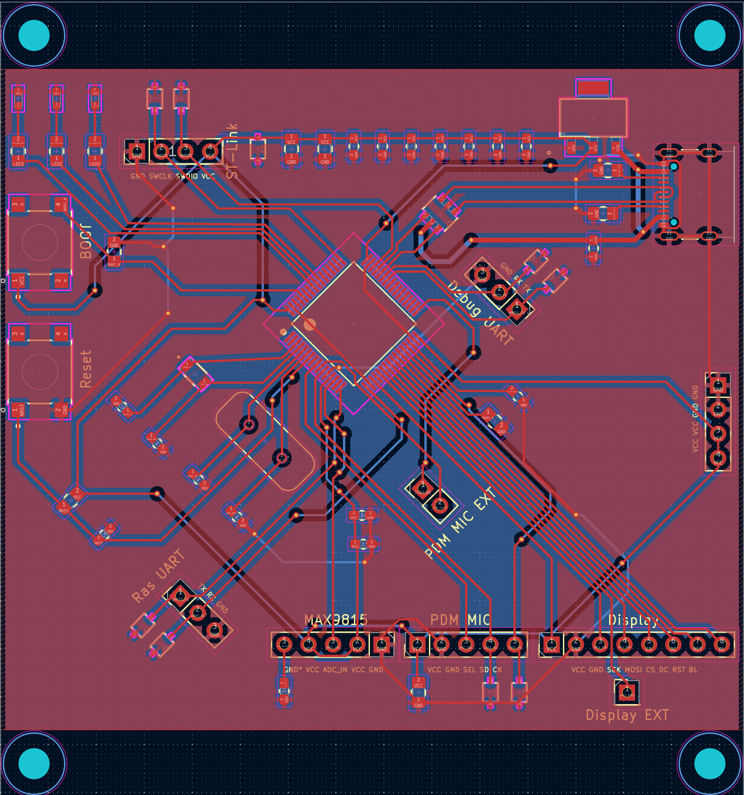

# Lab Notebook

## 1st Week

# 2/10
We are on the initial proposal state of our project. We want to build a local live transicription device. Considering the popularity of AI model these years, we hope to implement this device via an AI model. It seems we have a lot of options, such as Wisper and VOSK. Though Wisper uses a sequence to sequence transformer model, we worried about its performance on a edge computing paltform. Besides, the VOSK model's website mentioned this model runs well on edge device, such as Raspberry Pi or Jetson. Therefore, we decided to use VOSK to implement our device.

Then, our nect goal is determine the edge computing platform we will use. None of us has any experience with deploying a AI model on an edge device, so we need to ensure our computing platform is powerful enough. Here are several options: Jetson, Raspeberry Pi, or FPGA (PYNQ). Though PYNQ have decent performance and large enough memory to hold our VOSK model, there is no much resource available for us. Considering our initial goal is graduating, we do not want to risk ourself on a difficult project. Comparing Jetson and Raspebrry Pi, Jetson have much better performance. We seeked sugesstion from a TA, and he claimed Jetson would be a better solution for us. However, the latest Jetson Orin is out of stock. If we want to purchase the platform from the third party, its price was over 500! Finally, Raspberry Pi became our only choice. Our current problem is which Pi should we use?
Raspberry Pi 5 is the latest released platform. It is said that Pi 5's performance is about doubled of Pi 4. Therefore, we ordered Pi 5.


# 2/16
It is about the end of this week, and we received our Raspberry Pi 5. Our goal is deploying the VOSK model on Raspberry Pi 5. We have no experience with Raspberry Pi. We noticed Python is already installed, but we can not download library. After a series of googling, we figured out we need to set up evironment first........ We though the commend of Pi OS would be to Linux. However, there is a slightly difference. We found a Youtube video that is helpful with our project. By following its instructtion, we successfully deployed VOSK on our Pi. [https://www.youtube.com/watch?v=-0W_AxSD_t8](https://www.youtube.com/watch?v=-0W_AxSD_t8)Unlike the video, we had no mic there, so we just feed wav. file to the model to test its performance. We used two famous public speech: one is I Have a Dream, and the other is We choose to go to the Moon. The overall accuracy seemed decently good: it is just consistent with the expected value - 90%. 

For a sample sentence with 20 words, there are 2 errors:

```math
ErrorRate = \frac{ErrorWords}{TotalWords} = \frac{2}{20}
```

We made our initial block diagram:


## 2nd Week

# 3/6

We worked on breadboard demo. Since our LCD cannot arrive before the demo date. We used the gme12864 OLED display with an Arduino to show transcribed texts for our demo. The display could successfully displayed characters. Then, our next goal is displaying received text from UART on the display.


This is an online tutorial of setting up we used: [https://www.instructables.com/Monochrome-096-i2c-OLED-display-with-arduino-SSD13/](https://www.instructables.com/Monochrome-096-i2c-OLED-display-with-arduino-SSD13/)

## 3rd Week

# 3/11
Assume the lecturer speaks 4 words per second (the normal speaking speed should be 2 – 3 words per second). Each letter consumes 7 bits of resource during transmission, and we assume each word has 8 letters on average (which should normally be 6). Hence, the transmission speed requirement is:

```math
Speed = 4 \frac{word}{s} * 8 \frac{letter}{word} * 7 \frac{bit}{letter} = 224 b/s
```

The speed is lower to the UART ports.

We decided to use Arduino test our functionality. Though the demo stage may be fairly different from the our actual PCB, we still need to make proposal is reasonbale. We connected the Raspberry Pi's TX and RX to Arduino's RX and TX. Nothing was received or transmitted. A potential reason could be Arduino's logic level is inconsistent with Raspberry Pi's. Arduino's is 5V and Pi's is 3.3V. However, it does not make sense there is nothing transmitted or received. We used an oscilloscope to visualize the voltage level of Pi's TX, and the TX remains at 0V. We concerned that we might just burnd Pi's UART.


# 3/13
We just noticed a crucial point missed on our proposal stage: the Raspberry Pi 5 requires a 5A current supply, or its peripherals are restricted. The normal buck booster can only be used under a small current. The DC-DC seems to be an applicable approach; however, supporting 5A is costly and requires a special PCB. It seems there are some advanced power management chips, but those chips have excessive requirements on battery. Inspired by a video of DIY a power bank, we guess a feasible approach is to integrate a power bank into our design. Here is its link: [https://www.bilibili.com/video/BV1Ft421j7j6?spm_id_from=333.788.recommend_more_video.-1&vd_source=d8237448c0989c98c18ea372f881b1c2](https://www.bilibili.com/video/BV1Ft421j7j6?spm_id_from=333.788.recommend_more_video.-1&vd_source=d8237448c0989c98c18ea372f881b1c2). However, we can't purchase a power management chip for this power bank. Besides, none of us have any experience with design a complex power manage circuit. Considering our current progress, we should not spend too much time on designing a unreliable manager. Therefore, the best option for our design is using a pre-built power bank to power our system.

## 4th Week

# 3/17
We wired the Raspberry Pi's RX and TX ports and confirmed that its UART works perfectly. The tool we used to test our UART is called Minicom.


After a series of research and tests, we realized that our Arduino board's USB port occupies a UART. Since the UART is always occupied by the USB, we could not see received characters from the Raspberry Pi. It seems we could not see the UART result by using Arduino board. We ordered a Nulceo board.
UART test passed! We confirm the functionality of transmitting text from the Raspberry Pi to the STM32 via UART. Here is the pseudocode:

STM32
Initilize_UART1();
Initilize_UART2();

while (1) {
    UART1_Receive(Msg);
    UART2_Send(Msg); //Send Msg to PC via USB, since UART2 is occupied by USB
}

Pi
import serial

msg = "Hello World!"

for char in msg:
    ser.write(char.encode('utf-8'))


# 3/20
Mic demo failed. Our analog mic cannot capture an audio signal with satisfactory quality to feed into the VOSK model. We decided to take advantage of ADC inside the STM32.
Since our mic is connected to the STM32, we must figure out a solution to transmit the audio signal from the STM32 to the Raspberry Pi. Though UART + DMA is fast enough, the received audio quality is really poor on the Raspberry Pi. By researching, we finalize to use the PDM Mic that outputs digital data.

## 5th Week

# 3/26
The PDM mic is lost by the post company. We cannot miss the third round of PCB order. We decided to use a USB mic that is connects to the Raspberry Pi. Then, the mic test passed.
Display test passed! All functionality tests passed! Those codes are made by my group mates. Currently, the transcribed text can successfully display transcribed text characters on the display. However, the speed is fairly slow. We need to optimize its software.


# 3/27
The second version of PCB is updated. I still leave a lot of I/O in case we have more time to add some features.


## 6th Week

# 3/30
We received our PCB, and I will work on soldering the PCB. My hand soldering technique is bad, and I burn 3 MCUs.......


We do not have a stencil, so it is too hard for me to solder the STM32 on our PCB. We have already ordered our PCB of third round group order.

## 7th Week

# 4/10
We received our PCB with a stencil.
The solder paste provided by the department is weird. Though its melting point is around 200 °C, it does not melt inside the reflow solder station when we set the temperature to 300 °C. No more STM32.

# 4/11
I have redesigned our PCB and ordered it on fourth round. It seems we have no more time, and that board will not show in our project. Here is the new PCB layout.


# 4/14
We received our second round of MCU. I tried to use the reflow soldering stage first. Then, I moved the PCB to the hot air rework station to solidified the solder. It looks good.
I try to light a LED on our PCB, and PCB test passed!

# 4/15
The case design is finished.
The remaining work is optimize the software on STM32 and Pi. Those tasks belonged to our software experts in our group.