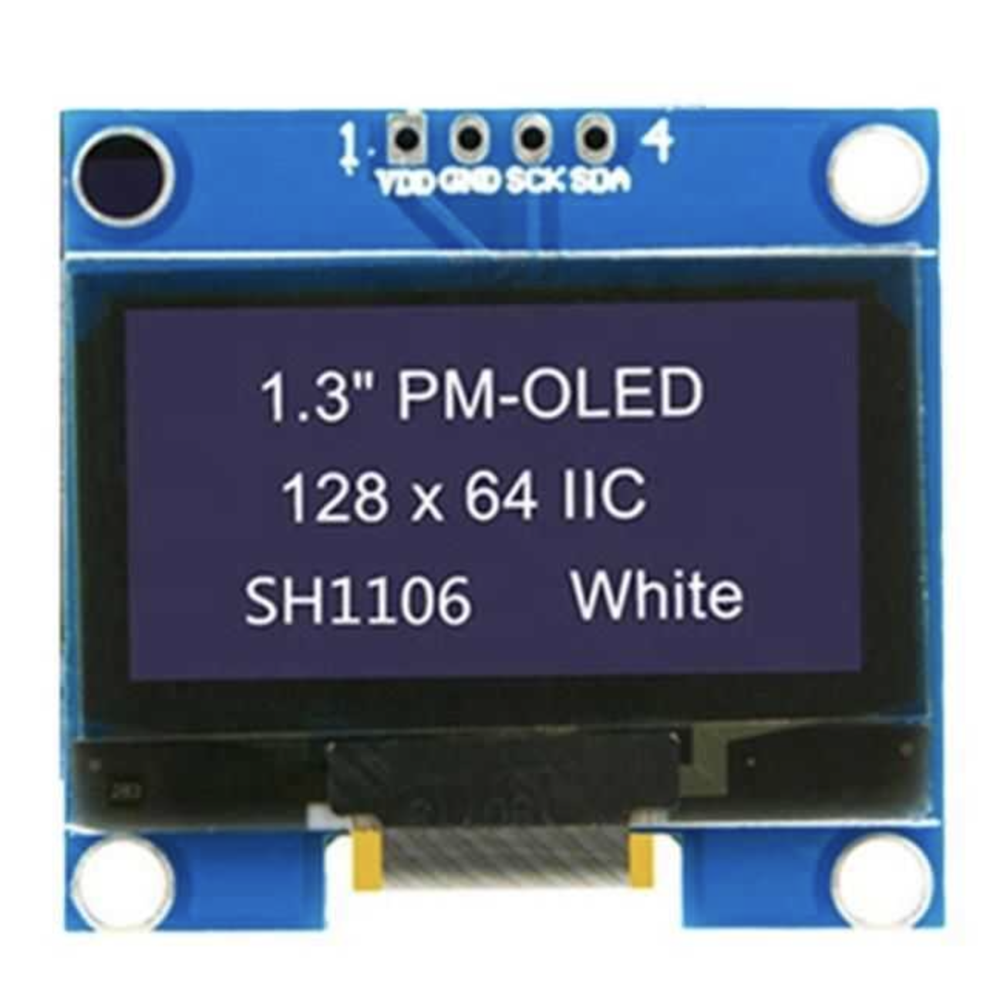
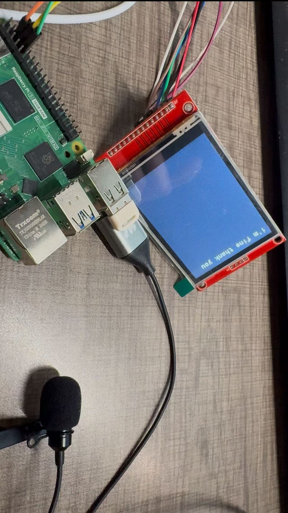

# Lab Notebook

## 1st Week
Deployed the VOSK model on the Raspberry Pi 5. This YouTube video inspired us a lot.
[https://www.youtube.com/watch?v=-0W_AxSD_t8](https://www.youtube.com/watch?v=-0W_AxSD_t8)

## 2nd Week
Worked on breadboard demo. Since our LCD cannot arrive before the demo date. We used the gme12864 OLED display with an Arduino to show transcribed texts for our demo. The display could successfully displayed characters. Then, our next goal is displaying received text from UART on the display.

This is an online tutorial of setting up we used: [https://www.instructables.com/Monochrome-096-i2c-OLED-display-with-arduino-SSD13/](https://www.instructables.com/Monochrome-096-i2c-OLED-display-with-arduino-SSD13/)

## 3rd Week
The UART did not work. We connected the Raspberry Pi's TX and RX to Arduino's RX and TX. Nothing was received or transmitted.

We just noticed a crucial point missed on our proposal stage: the Raspberry Pi 5 requires a 5A current supply, or its peripherals are restricted. The normal buck booster can only be used under a small current. The DC-DC seems to be an applicable approach; however, supporting 5A is costly and requires a special PCB. It seems there are some advanced power management chips, but those chips have excessive requirements on battery. Inspired by a video of DIY a power bank, we guess a feasible approach is to integrate a power bank into our design. Here is its link: [https://www.bilibili.com/video/BV1Ft421j7j6?spm_id_from=333.788.recommend_more_video.-1&vd_source=d8237448c0989c98c18ea372f881b1c2](https://www.bilibili.com/video/BV1Ft421j7j6?spm_id_from=333.788.recommend_more_video.-1&vd_source=d8237448c0989c98c18ea372f881b1c2). However, we can't purchase a power management chip for this power bank. Besides, none of us have any experience with design a complex power manage circuit. Considering our current progress, we should not spend too much time on designing a unreliable manager. Therefore, the best option for our design is using a pre-built power bank to power our system.

## 4th Week
We wired the Raspberry Pi's RX and TX ports and confirmed that its UART works perfectly. The tool we used to test our UART is called Minicom.

After a series of research and tests, we realized that our Arduino board's USB port occupies a UART. Since the UART is always occupied by the USB, we could not see received characters from the Raspberry Pi. It seems we could not see the UART result by using Arduino board. We ordered a Nulceo board.
UART test passed! We confirm the functionality of transmitting text from the Raspberry Pi to the STM32 via UART.
Mic demo failed. Our analog mic cannot capture an audio signal with satisfactory quality to feed into the VOSK model. We decided to take advantage of ADC inside the STM32.
Since our mic is connected to the STM32, we must figure out a solution to transmit the audio signal from the STM32 to the Raspberry Pi. Though UART + DMA is fast enough, the received audio quality is really poor on the Raspberry Pi. By researching, we finalize to use the PDM Mic that outputs digital data.

## 5th Week
The PDM mic is lost by the post company. We cannot miss the third round of PCB order. We decided to use a USB mic that is connects to the Raspberry Pi. Then, the mic test passed.
Display test passed! All functionality tests passed! The transcribed text can successfully display transcribed text characters on the display. However, the speed is fairly slow. We need to optimize its software.

## 6th Week
We received our PCB.
We received our PCB with a stencil.

## 7th Week
I worked on the python code. We initially ran the model. Each transcribed sentence will be sent to a set which just coverts each character of the sentence into an individual element. I packed each character into a UART package. I used the minicom to test UART packages, and everything looks good.
The overlap issue is caused by the driver. We implemented an automatically line switch function under our main program and record the current line. The fact is that the driver also has a line switching functionality. I tried to modified the driver directly.
Line overlap solved. Everything looks good now.

## 8th Week
We are here together to put everything in the box. We did do verifications on our requirement and our system successfully passed the verification.
The accuracy of our system is good and the speed is acceptable. Here is an example we tested:

A poem by Langston Hughes:
[Watch the Poem Demo](project_demo_video.mp4)
